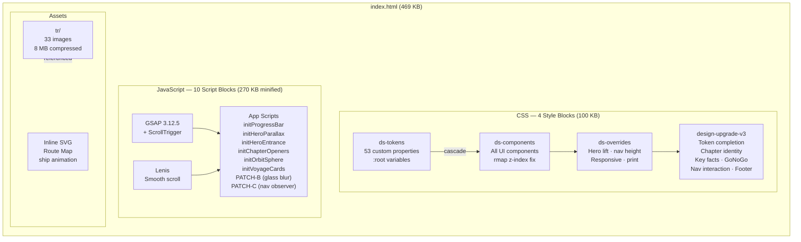
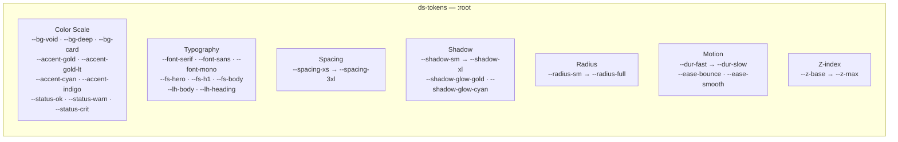
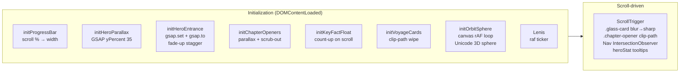
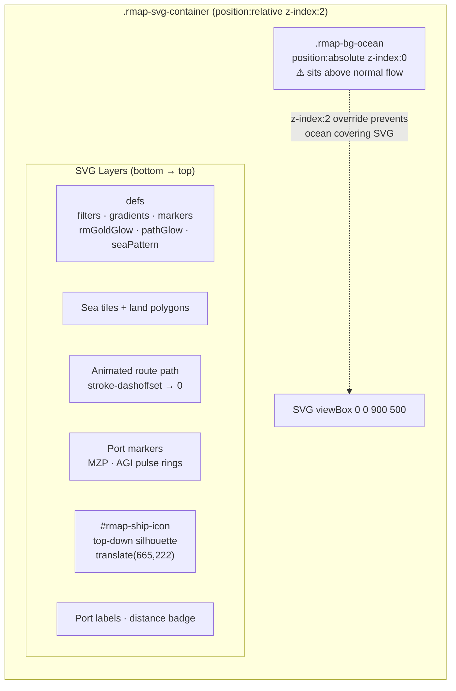

---
# System Architecture

## Overview

`index.html` is a fully self-contained single-file web application. No build step required.

## CSS Token System

## JavaScript Module Map

## Route Map SVG Architecture

## External Dependencies

| Dependency | Version | Load Method | Size |
|-----------|---------|-------------|------|
| Google Fonts | — | `<link>` CDN | ~40KB |
| GSAP | 3.12.5 | Inline bundle | ~200KB |
| ScrollTrigger | 3.12.5 | Inline bundle | ~40KB |
| Lenis | latest | Inline bundle | ~15KB |

> All JS is bundled inline — the report works **offline** after first load (Google Fonts cached).

## Browser Compatibility

| Feature | Min Version |
|---------|------------|
| CSS custom properties | Chrome 49 / Safari 9.1 |
| `clamp()` | Chrome 79 / Safari 13.1 |
| `inset:` shorthand | Chrome 87 / Safari 14.1 |
| Canvas 2D | Universal |
| GSAP ScrollTrigger | IE not supported |
---
