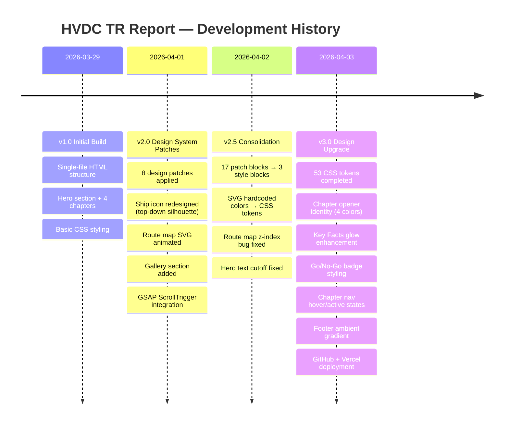

---
# Changelog

All notable changes to the HVDC TR Report are documented here.

---

## [v3.0] — 2026-04-03

### Added
- **Design tokens completed**: Shadow scale (`--shadow-sm` → `--shadow-xl`, `--shadow-glow-gold/cyan`), Radius scale (`--radius-sm` → `--radius-full`), Motion scale (`--dur-fast` → `--dur-slow`, `--ease-bounce/smooth`), Z-index scale (`--z-base` → `--z-max`)
- **Chapter Opener identity**: Per-chapter color tints (Ch1: gold, Ch2: cyan, Ch3: indigo, Ch4: emerald) via CSS custom property `--chap-tint`
- **Key Facts section**: Ambient radial gradient background, tabular-nums, gold text-shadow glow with hover enhancement
- **Go/No-Go badges**: `.gngo-verdict.go` (green), `.gngo-verdict.nogo` (red), row hover interaction, date column accent
- **Chapter Nav states**: hover (gold-lt color transition), active (glow box-shadow)
- **Footer finishing**: Top fade-in gradient, ambient gold radial, brand opacity hover
- **GitHub repository**: `https://github.com/macho715/tr_report.git`
- **Vercel deployment**: Static hosting
- **Documentation**: README, LAYOUT, ARCHITECTURE, CHANGELOG (all with Mermaid diagrams)

### Changed
- Hero orbit sphere: 80% of 150% scale (`clamp(456px, 50vw, 672px)`)
- Orbit position: `bottom: 18%` (lifted from `5%`)
- Image assets: Compressed to JPEG q=80, max 1920px (57MB → 8MB, 84.6% reduction)

### Folder Organization
- `tr 문서/` reorganized: 9 new subfolders (`video/`, `docs/`, `web/`, `scripts/`, `data/`, `captures/`, `markdown/`, `contacts/`, `archive/`)
- 221 files moved from root to categorized folders

---

## [v2.5] — 2026-04-02

### Added
- `<style id="ds-tokens">` — 53 CSS custom properties
- `<style id="ds-components">` — all component selectors
- `<style id="ds-overrides">` — responsive + hero lift

### Changed
- Consolidated 17 patch `<style>` blocks → 3 named blocks
- SVG inline colors: 16 hardcoded hex values → `var(--accent-gold)`, `var(--accent-gold-lt)`

### Fixed
- **Route map disappeared** after consolidation: Added `position: relative; z-index: 2` to `.rmap-svg-container` to prevent `.rmap-bg-ocean` (absolute, z-index: 0) from covering the SVG
- **Hero text cutoff**: `#hero { padding-bottom: clamp(120px, 16vh, 180px) }` lifts content above viewport bottom

---

## [v2.0] — 2026-04-01

### Added
- GSAP 3.12.5 + ScrollTrigger + Lenis (all inlined)
- `initOrbitSphere()` — Unicode 3D rotating canvas on hero
- `initVoyageCards()` — clip-path wipe reveal on scroll
- `initKeyFactFloat()` — count-up number animation
- Route Map SVG with animated ship path (GSAP motionPath)
- 8 design patch style blocks

### Changed
- Ship icon: redesigned as top-down silhouette with hull, bridge, cargo hold, LCT label
- Chapter nav: sticky 78px with chapter indicator

### Fixed
- RACI table overflow on mobile
- Glass card stacking context

---

## [v1.0] — 2026-03-29

### Added
- Initial single-file HTML report
- 4 chapters: Cargo Specs, Voyage Log, Operations Analysis, Close-out
- Hero section with background image
- Chapter navigation
- Basic typography and color tokens
- Go/No-Go decision table
- Footer with attribution
