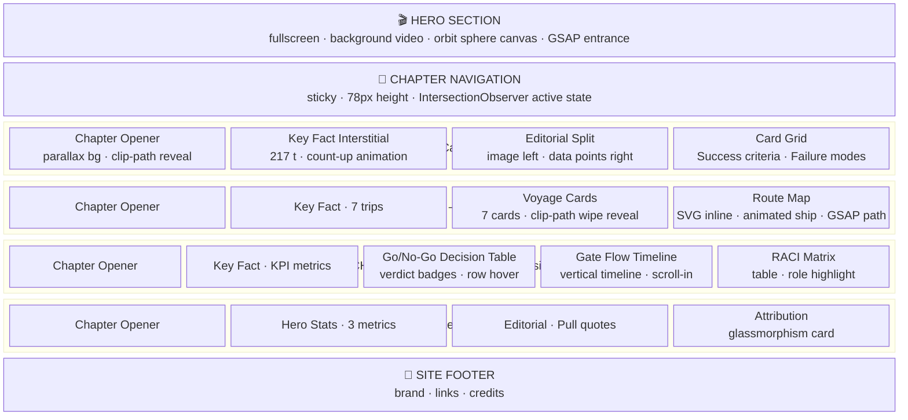
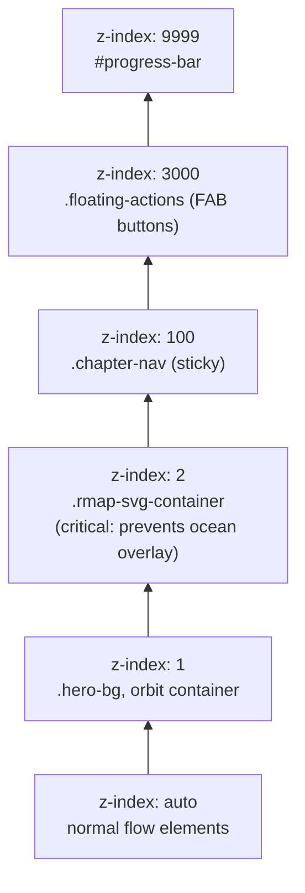
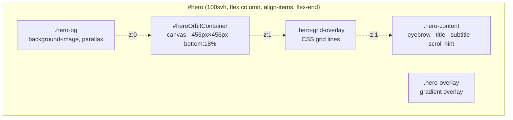
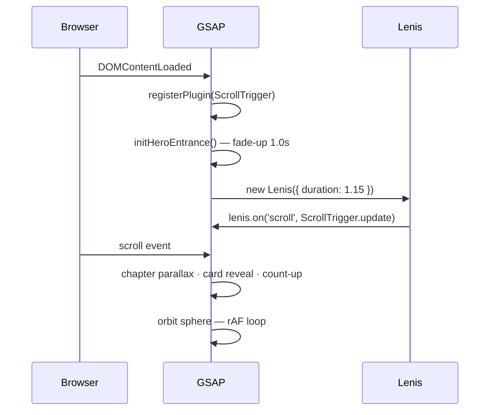

---
# Page Layout Documentation

## Section Structure

The report is a single scrolling page with 7 major sections.

## Z-index Stacking Order

## Responsive Breakpoints

| Breakpoint | Width | Layout Change |
|-----------|-------|---------------|
| `--bp-xs` | 480px | Single column, reduced padding |
| `--bp-sm` | 640px | Mobile nav condensed |
| `--bp-md` | 768px | Editorial splits stack |
| `--bp-lg` | 1024px | Full desktop layout |
| `--bp-xl` | 1280px | Max content width |
| `--bp-2xl` | 1536px | Wide screen spacing |

## Hero Section Layout

## Animation Timeline (Page Load)

---
