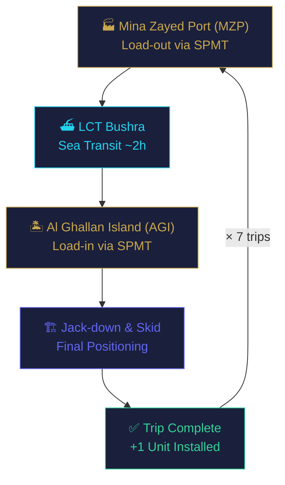
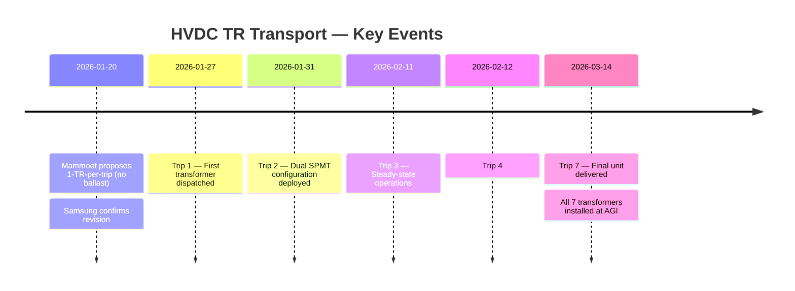
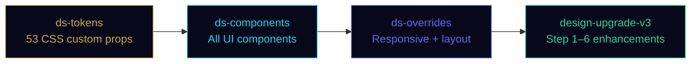

# HVDC TR Transport Operations Report

**Independent Subsea HVDC System Project (Project Lightning) — UAE**
Internal operations report covering 765 kV single-phase transformer transport from Mina Zayed Port (MZP) to Al Ghallan Island (AGI).

## Overview

This single-page HTML report documents the full transport operation for **7 × 765 kV single-phase transformers (217 t each)** using LCT Bushra and SPMT across 7 individual trips.

| Item | Value |
|------|-------|
| Cargo | TM-63 Transformer × 7 units |
| Unit Weight | 217.0 t |
| Transport Mode | LCT (sea) + SPMT (road) |
| Trips | 7 × single-unit |
| Period | 2026-01-27 ~ 2026-03-14 |
| Route | MZP → AGI (approx. 18 km) |

## Operation Flow



## Project Milestones



## Tech Stack

| Layer | Technology |
|-------|-----------|
| Markup | HTML5 (single-file, self-contained) |
| Styling | CSS Custom Properties (Design System) |
| Animation | GSAP 3.12.5 + ScrollTrigger |
| Scroll | Lenis smooth scroll |
| Maps | Inline SVG + GSAP path animation |
| Fonts | Google Fonts (Playfair Display, Source Serif 4, Inter, JetBrains Mono) |

## CSS Design System



## Local Usage

```bash
# Clone
git clone https://github.com/macho715/tr_report.git
cd tr_report

# Open (no build step required)
open index.html          # macOS
start index.html         # Windows
xdg-open index.html      # Linux
```

> **Note:** Requires internet connection for Google Fonts. All JS libraries are bundled inline.

## Live Demo

🌐 Deployed via Vercel — see [Deployment](#) for URL.

## File Structure

```
tr_report/
├── index.html          Main report (single-file, 469 KB)
├── tr/                 Image assets (33 files, 8 MB compressed)
├── docs/
│   ├── README.md       This file
│   ├── LAYOUT.md       Page layout documentation
│   ├── ARCHITECTURE.md CSS/JS architecture
│   └── CHANGELOG.md    Version history
├── .gitignore
└── vercel.json
```

## License

Internal document — Samsung C&T / QJC. Not for public distribution.
